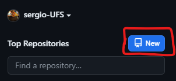
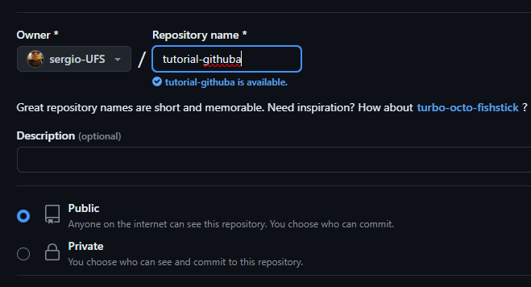
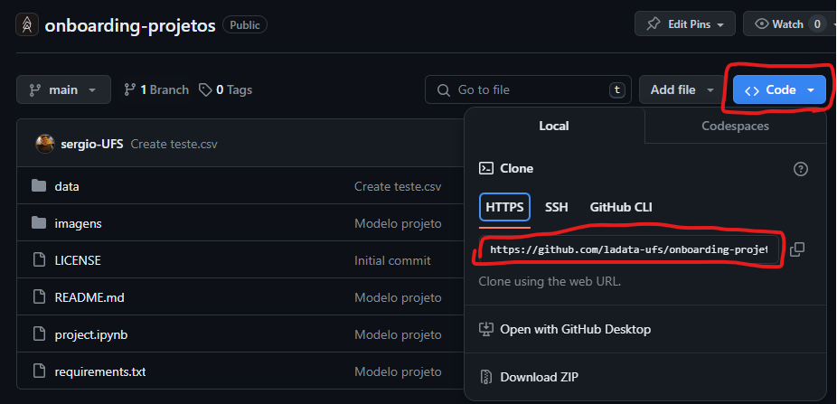
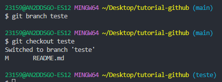
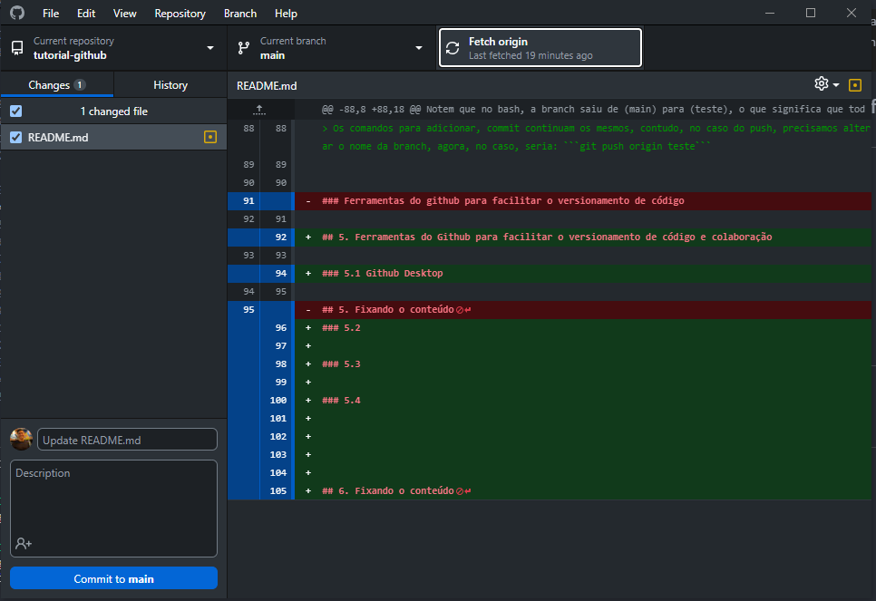
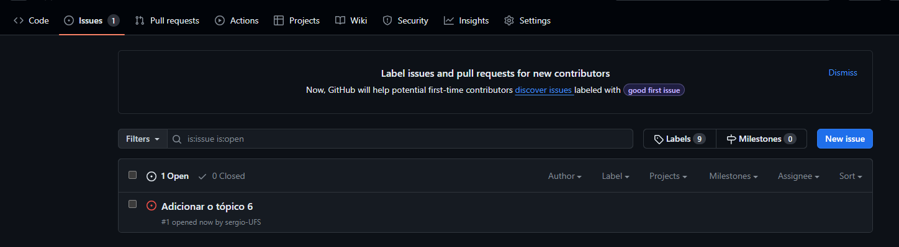
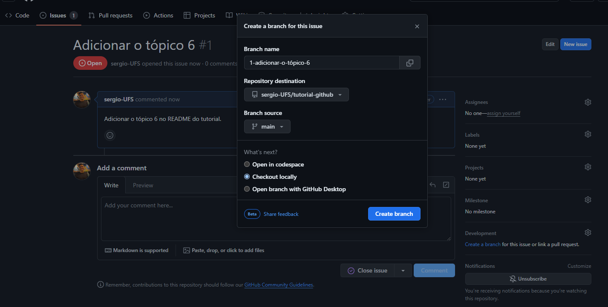
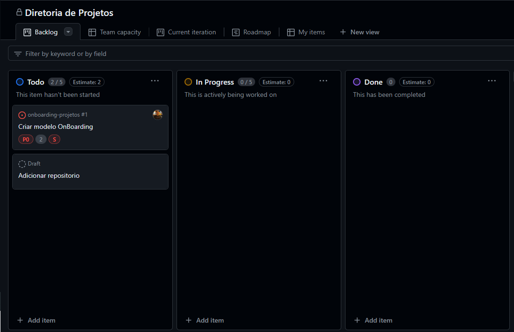

# Tutorial Git e Github

Página de tutorial para guiar nas funcionalidades e conceitos mais importantes do git e ferramentas do github

## 1. Primeiramente: O que é o git e por que separar do github?

Git é uma ferramenta de versionamento de códigos com base em ramificações de um código base, ou seja, o github usa git, assim como o gitLab, utiliza git. Chamamos o git por linha de comando de git CLI e pode ser baixado [aqui.](https://git-scm.com/)

Já o github se trata de uma plataforma que utiliza a tecnologia git para a hospedagem de código para projetos privados e abertos colaborativos, focados, principalmente no OpenSource, ou, projetos com poucos colaboradores. Atualmente, o github traz diversas opções para empresas e grandes projetos, o que facilita a utilização em maior escala.

No geral, para grandes projetos, ou empresas, a opção mais famosa é o GitLab, que é focado majoritariamente em repositórios fechados e grandes equipes.

Ademais, temos o costume de pensar que o git serve apenas para versionamento de código e software, mas pode-se utilizar para qualquer tipo de arquivo presente em um repositório, desde um txt a um arquivo executável. 


### Por que a LADATA escolheu o github?

>Como explicado anteriormente, o github trata de projetos com número limitado de colaboradores e foca no open-source. Como temos como um dos pilares a colaboração, é mais do que justo disponibilizarmos dicas, tutoriais e alguns códigos de projetos para a colaboração interna e externa com/para a Liga.


## 2. Instalando o git

Após baixar o git, basta apenas abrir e seguir os passos de instalação. Com isso, já podemos utilizar o "bash" do git. Então, para testar, basta:
- Criar uma pasta
- Adicionar um arquivo .txt e preencher 
- Abrir o git bash
- Digitar ```git init``` (Esse comando serve para iniciar um repositório git localmente)


Para registrar as alterações feitas, utilizamos um conjunto quase indispensável de comandos. (Depois de um tempo, já fica no automático 😂)

1. O git status, que serve para mapear arquivos que foram alterados e ainda necessitam ser adicionados no commit
```
git status  

``` 

2. o git add serve para adicionar um ou mais arquivos para serem commitados
```bash
git add .  #adiciona todos os arquivos do repositório 
git add <arquivo> #adiciona um arquivo específico para o commit
``` 

3. já o git commit, que é um dos comandos-chave da colaboração, com ele é possível usar o código alterado e devidamente adicionado para o commit em um "pacote" de alterações que será enviado ao repositório.
```bash
git commit -m "Primeiro commit" 

``` 

4. Ademais, temos o comando git push, que pega os commits pendentes na sua máquina e joga diretamente no repositório. O deixando disponíveis para consumo de outros colaboradores.

```bash
git push origin <branch>
```


## 3. Conexão com o GitHub

Aprendido como criar um repositório local, é importante saber como trazer um repositório do github para o repositório local e vice-versa.

Primeiramente, caso ainda não tenha um repositório que queira clonar do git, basta acessar o [Github](https://github.com) e criar um novo repositório.



É nessa tela que algumas configurações são definidas, como a visibilidade, o nome e a licença



Com o Repositório criado e o git instalado, basta que criemos uma pasta de interesse de onde esse repositório ficará e abrir o git bash. Feito isso, basta utilizar o comando ``` git clone <link do repositório>.git ```

> O  link do repositório é o link dele no github com .git no final, também é encontrado ao clicar em code e https 


## 4. Versionamento do repositório

Até aqui, vimos a parte de instalação do git e github e a criação de repositórios, contudo, em um ambiente colaborativo/corporativo, é normal que mais de uma pessoa precise trabalhar no mesmo código ao mesmo tempo, que pode gerar um dos problemas mais comuns (e chatos) de tratar, que são os conflitos.

Para isso, é utilizada a lógica de branchs, que consiste em basicamente criar uma cópia separada de um estado do código, onde é possível editar sem alterar de fato o código original. Com a possibilidade de ser incorporado no código original por meio de um "merge".

No git, para criarmos uma branch, basta usar o comando ```git branch <nome da branch>```. E então, para nos deslocarmos para esta, usamos ```git checkout <nome da branch>```



Notem que no bash, a branch saiu de (main) para (teste), o que significa que todas as alterações feitas nessa nova branch, pertencerão a essa nova branch ao invés de alterar diretamente a main.

> Os comandos para adicionar, commit continuam os mesmos, contudo, no caso do push, precisamos alterar o nome da branch, agora, no caso, seria: ```git push origin teste```


## 5. Ferramentas do Github para facilitar o versionamento de código e colaboração 

### 5.1 Github Desktop

O Github Desktop é um Software do próprio Github para facilitar as operações de git, sem a necessidade de utilizar as linhas de comando. Nele é possível monitorar os arquivos alterados, realizar os commits e os pushs diretamente e até resolver conflitos. Além disso, permite criar branchs e clonar os repositórios diretamente.



>Eu, particularmente, uso essa ferramenta em 90% do tempo, principalmente pela praticidade.

### 5.2 Issues






### 5.3 GitHub Projects




### 5.4 Pull Requests


## 6. Fixando o conteúdo


Para fixar o conteúdo, vamos utilxar um pequeno exercício, com o objetivo de fixar o conteúdo.

Lembre de dar uma estrela no repositório.